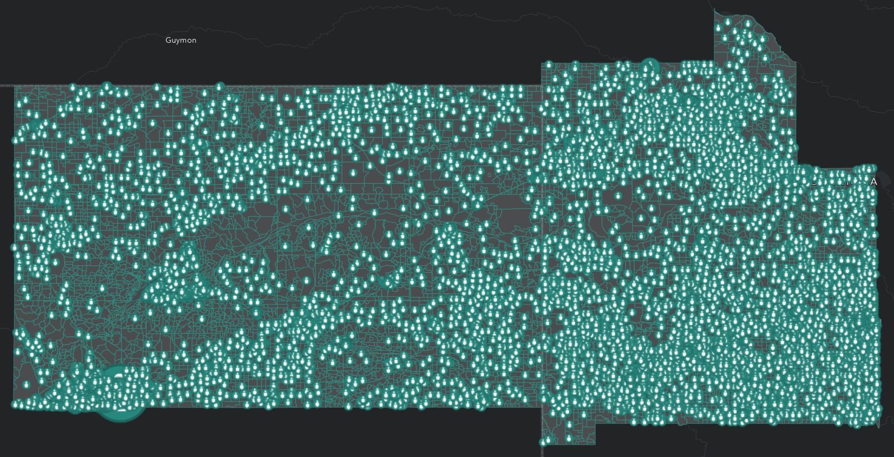
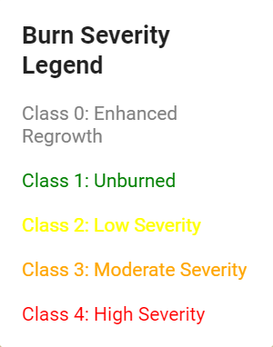
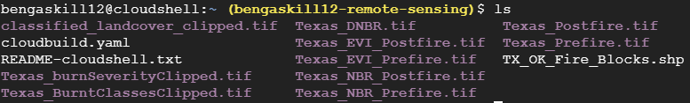

# Texas Wildfires: Change Detection of Smokehouse Creek Fire Using Google Earth Engine and PostGIS Spatial Database Queries

### Ben Gaskill
### IDCE 376, Spatial Database Development in Practice, Spring 2024
### Professor Jonathan Ocon and TA Kunal Malhan

This repository contains data and spatial analysis of the 2024 Smokehouse Creek Wildfire in Texas.

The initial contents of the repository can be navigated as follows:
1. The project proposal can be viewed in the *Gaskill_Proposal.pdf* document.
2. Google Earth Engine code for raster generation of FCC, EVI, NBR, DNBR, Burned Severity, and Burned Binary can be found [here](https://code.earthengine.google.com/b80f5e7fed31c15e0ee0efca2c5e241f)
3. The rubric can be viewed in the *Final_Project_Rubric.pdf* document.

## Data Sources
1. [Texas County Boundaries](https://gis-txdot.opendata.arcgis.com/datasets/TXDOT::texas-county-boundaries-detailed/about)
2. [Oklahoma County Boundaries](https://csagis-uok.opendata.arcgis.com/datasets/4180120bd0184f4c8183185947f638e7_0/explore?location=35.197309%2C-98.716546%2C6.80)
3. Texas 2020 Cenus Tract Block Level [(Obtained from ArcGIS Living Atlas)](https://www.arcgis.com/home/item.html?id=e71cbcf456084748ba0b8741d4f956d9)
4. Oklahoma 2020 Census Tract Block Level [(Obtained from ArcGIS Living Atlas)](https://www.arcgis.com/home/item.html?id=5ef7d4739af346ccba858abf2d70aeb9)
5. [2021 CONUS Landcover Dataset](https://www.mrlc.gov/viewer/)

## Pre-processing Steps
1. Detailed analysis of the wildfire was conducted in Google Earth Engine. See next section for details
2. Each output was exported from Google Earth Engine and visualized in QGIS.
3. The Texas and Oklahoma County Boundaries was subsetted and clipped to only include counties within the extent of the burn rasters.
4. The Texas and Oklahoma County 2020 Census data was opened in ArcGIS, and clipped to only include counties within the extent of the burn rasters. See below for an initial visualization.
5. The 2021 CONUS Landcover Dataset was clipped to the same extent as the other fire raster files.
6. A Google Cloud Postgres SQL database instance was set up and initialized with the name of "remotesensing", utilizing the existing Google Earth Engine Project with a subdirectory for this analysis.
7. All Raster files were vectorized utilizing the Polygonize function of QGIS and stored as a backup option. (Can be directly imported to a local POSTGIS enabled Postgres database using PGAdmin if necessary.

### 2020 Census Data Clipped to Extent of the Smokehouse Creek Fire

1. Texas Counties Include: Wheeler, Gray, Carson, Potter, Hemphill, Roberts, Hutchinson, Lipscomb, Ochiltree, Hansford, Sherman, and Moore Counties
2. Oklahoma Counties Include: Ellis, Woodward, Dewey, Roger Mills, Custer, Beckham, Washita

### 2021 CONUS Landcover Raster Clipped to Extent of the Smokehouse Creek Fire


## Description of raster (.TIF) files generated in Google Earth Engine
Landsat 9 Imagery was utilized. The original goal was to utilize Sentinel 2 imagery, but there were temporal inconsistencies.
1. FCC: False color composite, consisting of Short-Wave Infrared 2, Near Infrared, and Red bands of Landsat 9.
2. EVI: Enhanced Vegetation Index highlighting vegetation cover, using the following formula: EVI = 2.5 * ((NIR - RED) / (NIR + 6 * RED - 7.5 * BLUE  + 1))
3. NBR: Normalized Burn Ratio highlighting burned areas, using the following formula: NBR = (NIR -SWIR2) / (NIR + SWIR2)
4. DNBR: Difference Normalized Burn Ratio, an image differencing operation, using the following formula: dNBR = NBRprefire - NBRpostfire
5. Burned Severity: A classified burn map based on 5 classes: enhanced regrowth, unburned, low severity, moderate severity, and high severity.
6. Burned Binary: A binary classification map that shows burned vs unburned areas

## Map Layouts
### Prefire False Color Composite


### Postfire False Color Composite


### Prefire Enhanced Vegetation Index


### Postfire Enhanced Vegetation Index


### Prefire Normalized Burn Ratio


### Postfire Normalized Burn Ratio


### Difference Normalized Burn Ratio


### Burned Severity Classification
 <p align="center"></p>

### Burned vs Unburned Binary Classification


## Working with Google Cloud
### Pre-Processing Steps
1. Create a cloud project
2. Connect to Github and create triggers for push and pull
3. Create a cloud storage bucket and upload all rasters and shapefiles
4. Create Postgresql Instance in Google Cloud
   
### PostGIS Setup (in cloud console)
1. Navigate to the Postgresql bin  
   ```shell
   cd /usr/lib/postgresql/16/bin
   ```
3. Install PostGIS to Postgres  
   ```shell
   sudo apt install postgis
   ```
   
### Initial Connection, Database Creation, and Extensions (in cloud SQL shell)
1. Connect to Postgresql  
   ```shell
   gcloud sql connect remotesensing --user=postgres --quiet1
   ```  
2. Create Database    
   ```SQL
   CREATE DATABASE TEXASWILDFIRES;
   ``` 
4. Connect to database    
   ```SQL
   \c texaswildfires;
   ```
6. Create Postgis Extension   
   ```SQL
   CREATE EXTENSION POSTGIS;
   ```  
8. Create Postgis Raster Extension    
   ```SQL
   CREATE EXTENSION POSTGIS_RASTER;
   ```

### Import rasters and shapefiles from Cloud Storage Bucket to Local Cloud Console Environment
1. Navigate back to default directory
   ```shell
   cd ~
   ```
2. Run the gsutil to access each file in the bucket and save to local directory
   ```shell
   gsutil cp gs://texas_wildfire_bucket/Texas_Prefire.tif Texas_Prefire.tif
   gsutil cp gs://texas_wildfire_bucket/Texas_Postfire.tif Texas_Postfire.tif
   gsutil cp gs://texas_wildfire_bucket/Texas_NBR_Prefire.tif Texas_NBR_Prefire.tif
   gsutil cp gs://texas_wildfire_bucket/Texas_NBR_Postfire.tif Texas_NBR_Postfire.tif
   gsutil cp gs://texas_wildfire_bucket/Texas_EVI_Prefire.tif Texas_EVI_Prefire.tif
   gsutil cp gs://texas_wildfire_bucket/Texas_EVI_Postfire.tif Texas_EVI_Postfire.tif
   gsutil cp gs://texas_wildfire_bucket/Texas_DNBR.tif Texas_DNBR.tif
   gsutil cp gs://texas_wildfire_bucket/Texas_BurntClassesClipped.tif Texas_BurntClassesClipped.tif
   gsutil cp gs://texas_wildfire_bucket/Texas_burnSeverityClipped.tif Texas_burnSeverityClipped.tif
   gsutil cp gs://texas_wildfire_bucket/classified_landcover_clipped.tif classified_landcover_clipped.tif
   gsutil cp gs://texas_wildfire_bucket/TX_OK_Fire_Blocks.shp TX_OK_Fire_Blocks.shp
   ```
The screenshot below shows the raster and vector files listed in the local directory:

