# Texas Wildfires: Change Detection of Smokehouse Creek Fire Using Google Earth Engine and PostGIS Spatial Database Queries  
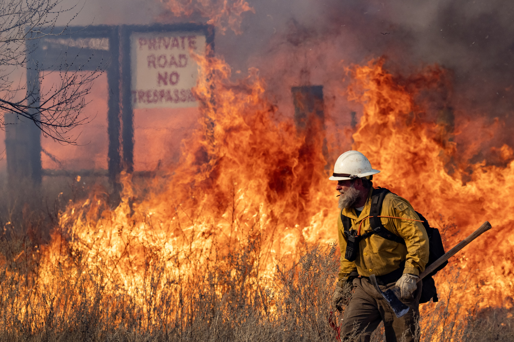

### Ben Gaskill
### IDCE 376, Spatial Database Development in Practice, Spring 2024
### Professor Jonathan Ocon and TA Kunal Malhan

This repository contains data and spatial analysis of the 2024 Smokehouse Creek Wildfire in Texas.

The initial contents of the repository can be navigated as follows:
1. The project proposal can be viewed in the *Gaskill_Proposal.pdf* document.
2. Google Earth Engine code for raster generation of FCC, EVI, NBR, DNBR, Burned Severity, and Burned Binary can be found [here](https://code.earthengine.google.com/b80f5e7fed31c15e0ee0efca2c5e241f)
3. The rubric can be viewed in the *Final_Project_Rubric.pdf* document.

## Background
The Smokehouse Creek was the largest wildfire in Texas history. Lasting from February 26th to March 16th, 2024, the fire was caused by downed power lines. The extent of the fire crosses state boundaries and also includes portions of eastern Oklahoma.

## Data Sources
1. [Texas County Boundaries](https://gis-txdot.opendata.arcgis.com/datasets/TXDOT::texas-county-boundaries-detailed/about)
2. [Oklahoma County Boundaries](https://csagis-uok.opendata.arcgis.com/datasets/4180120bd0184f4c8183185947f638e7_0/explore?location=35.197309%2C-98.716546%2C6.80)
3. Texas 2020 Census Tract Block Level [(Obtained from ArcGIS Living Atlas)](https://www.arcgis.com/home/item.html?id=e71cbcf456084748ba0b8741d4f956d9)
4. Oklahoma 2020 Census Tract Block Level [(Obtained from ArcGIS Living Atlas)](https://www.arcgis.com/home/item.html?id=5ef7d4739af346ccba858abf2d70aeb9)
5. [2021 CONUS Landcover Dataset](https://www.mrlc.gov/viewer/)

## Pre-processing Steps
1. Detailed analysis of the wildfire was conducted in Google Earth Engine. See the next section for details
2. Each output was exported from Google Earth Engine and visualized in QGIS.
3. The Texas and Oklahoma County Boundaries were subsetted and clipped to only include counties within the extent of the burn rasters.
4. The Texas and Oklahoma County 2020 Census data was opened in ArcGIS, and clipped to only include counties within the extent of the burn rasters. See below for an initial visualization.
5. The 2021 CONUS Landcover Dataset was clipped to the same extent as the other fire raster files.
6. A Google Cloud Postgres SQL database instance was set up and initialized with the name of "remotesensing", utilizing the existing Google Earth Engine Project with a subdirectory for this analysis.
7. All Raster files were vectorized utilizing the Polygonize function of QGIS and stored as a backup option. (Can be directly imported to a local POSTGIS-enabled Postgres database using PGAdmin if necessary.

### 2020 Census Data Clipped to Extent of the Smokehouse Creek Fire

1. Texas Counties Include: Wheeler, Gray, Carson, Potter, Hemphill, Roberts, Hutchinson, Lipscomb, Ochiltree, Hansford, Sherman, and Moore Counties
2. Oklahoma Counties Include: Ellis, Woodward, Dewey, Roger Mills, Custer, Beckham, Washita

### 2021 CONUS Landcover Raster Clipped to Extent of the Smokehouse Creek Fire


## Description of raster (.TIF) files generated in Google Earth Engine
Landsat 9 Imagery was utilized. The original goal was to utilize Sentinel 2 imagery, but there were temporal inconsistencies.
1. FCC: False color composite, consisting of Short-Wave Infrared 2, Near Infrared, and Red bands of Landsat 9.
2. EVI: Enhanced Vegetation Index highlighting vegetation cover, using the following formula: EVI = 2.5 * ((NIR - RED) / (NIR + 6 * RED - 7.5 * BLUE  + 1))
   - Note: the EVI was calculated with a blue, white, and green palette with normalized visualization parameters ranging from -1 (water) to 0 (no vegetation) to 1 (high vegetation).
4. NBR: Normalized Burn Ratio highlighting burned areas, using the following formula: NBR = (NIR -SWIR2) / (NIR + SWIR2)
5. DNBR: Difference Normalized Burn Ratio, an image differencing operation, using the following formula: dNBR = NBRprefire - NBRpostfire
6. Burned Severity: A classified burn map based on 5 classes: enhanced regrowth, unburned, low severity, moderate severity, and high severity.
7. Burned Binary: A binary classification map that shows burned vs unburned areas

## Map Layouts
### Prefire False Color Composite


### Postfire False Color Composite


### Prefire Enhanced Vegetation Index


### Postfire Enhanced Vegetation Index


### Prefire Normalized Burn Ratio


### Postfire Normalized Burn Ratio


### Difference Normalized Burn Ratio


### Burned Severity Classification
 <p align="center"></p>

### Burned vs Unburned Binary Classification


## Working with Google Cloud
### Pre-Processing Steps
1. Create a cloud project  
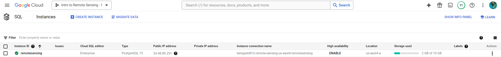
3. Create a cloud storage bucket and upload all rasters and shapefiles  
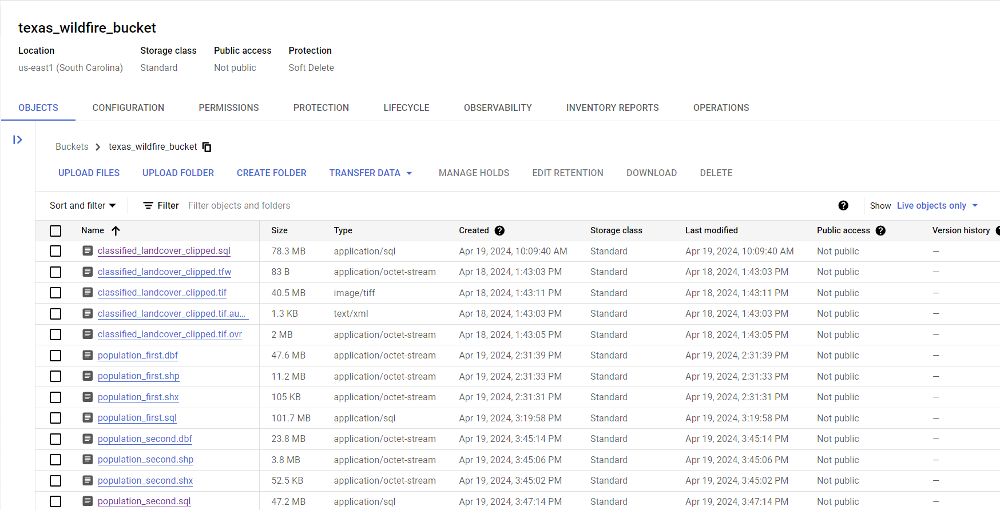
5. Create a Postgresql Instance in Google Cloud  
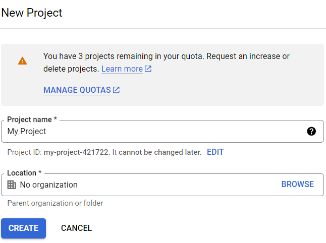
     
### PostGIS Setup (in cloud console)
1. Navigate to the Postgresql bin  
   ```shell
   cd /usr/lib/postgresql/16/bin
   ```
3. Install PostGIS to Postgres  
   ```shell
   sudo apt install postgis
   ```
   
### Initial Connection, Database Creation, and Extensions (in cloud SQL shell)
1. Connect to Postgresql  
   ```shell
   gcloud sql connect remotesensing --user=postgres --quiet
   ```  
2. Create Database    
   ```SQL
   CREATE DATABASE TEXASWILDFIRES;
   ``` 
4. Connect to database    
   ```SQL
   \c texaswildfires;
   ```
6. Create Postgis Extension   
   ```SQL
   CREATE EXTENSION POSTGIS;
   ```  
8. Create Postgis Raster Extension    
   ```SQL
   CREATE EXTENSION POSTGIS_RASTER;
   ```

### Import rasters and shapefiles from Cloud Storage Bucket to Local Cloud Console Environment
1. Navigate back to default directory
   ```shell
   cd ~
   ```
2. Run the gsutil to access each file in the bucket and save to local directory
   ```shell
   gsutil cp gs://texas_wildfire_bucket/Texas_Prefire.tif Texas_Prefire.tif
   gsutil cp gs://texas_wildfire_bucket/Texas_Postfire.tif Texas_Postfire.tif
   gsutil cp gs://texas_wildfire_bucket/Texas_NBR_Prefire.tif Texas_NBR_Prefire.tif
   gsutil cp gs://texas_wildfire_bucket/Texas_NBR_Postfire.tif Texas_NBR_Postfire.tif
   gsutil cp gs://texas_wildfire_bucket/Texas_EVI_Prefire.tif Texas_EVI_Prefire.tif
   gsutil cp gs://texas_wildfire_bucket/Texas_EVI_Postfire.tif Texas_EVI_Postfire.tif
   gsutil cp gs://texas_wildfire_bucket/Texas_DNBR.tif Texas_DNBR.tif
   gsutil cp gs://texas_wildfire_bucket/Texas_BurntClassesClipped.tif Texas_BurntClassesClipped.tif
   gsutil cp gs://texas_wildfire_bucket/Texas_burnSeverityClipped.tif Texas_burnSeverityClipped.tif
   gsutil cp gs://texas_wildfire_bucket/classified_landcover_clipped.tif classified_landcover_clipped.tif
   gsutil cp gs://texas_wildfire_bucket/TX_OK_Fire_Blocks.shp TX_OK_Fire_Blocks.shp
   ```  
   The screenshot below shows the raster and vector files listed in the local directory:  
   

### Convert all Rasters to SQL Files
1. When trying to run raster2pgsql, I encountered the following error  
   ```shell
   command "raster2pgsql" not found
   ```
2. If this error occurs, navigate back to the Postgresql bin and reinstall PostGIS before trying again
3. We can now successfully run the raster2pgsql command to convert all .tif files to .sql
   ```shell
   raster2pgsql -s 4326 -I -C -M Texas_Prefire.tif public.texas_prefire_rast > texas_prefire.sql
   raster2pgsql -s 4326 -I -C -M Texas_Postfire.tif public.texas_postfire_rast > texas_postfire.sql
   raster2pgsql -s 4326 -I -C -M Texas_NBR_Prefire.tif public.texas_nbr_prefire_rast > texas_nbr_prefire.sql
   raster2pgsql -s 4326 -I -C -M Texas_NBR_Postfire.tif public.texas_nbr_postfire_rast > texas_nbr_postfire.sql
   raster2pgsql -s 4326 -I -C -M Texas_EVI_Prefire.tif public.texas_evi_prefire_rast > texas_evi_prefire.sql
   raster2pgsql -s 4326 -I -C -M Texas_EVI_Postfire.tif public.texas_evi_postfire_rast > texas_evi_postfire.sql
   raster2pgsql -s 4326 -I -C -M Texas_DNBR.tif public.texas_DNBR_rast > texas_DNBR.sql
   raster2pgsql -s 4326 -t 30x30 -I -C -M Texas_BurntClassesClipped.tif public.texas_BurntClassesClipped_rast > texas_BurntClassesClipped.sql
   raster2pgsql -s 4326 -t 30x30 -I -C -M Texas_burnSeverityClipped.tif public.texas_burnSeverityClipped_rast > texas_burnSeverityClipped.sql
   raster2pgsql -s 4326 -I -C -M classified_landcover_clipped.tif public.classified_landcover_clipped_rast > classified_landcover_clipped.sql
   ```

## Difficulties With Google Cloud And Solutions  
I ran into many unexpected issues using Google Cloud. With enough troubleshooting, however, it is possible to overcome these obstacles. Below are a few problems and solutions to take note of:

### Issue 1: Fix 100% Storage in the Home Directory
1. Before running the shp2pgsql command for shapefiles, I encountered the following error:

2. Remove the unnecessary .tif files that are stored in the home directory. They are safely stored in the cloud storage bucket.
   ```shell
   rm Texas_Prefire.tif
   rm Texas_Postfire.tif
   rm Texas_NBR_Prefire.tif
   rm Texas_NBR_Postfire.tif
   rm Texas_EVI_Prefire.tif
   rm Texas_EVI_Postfire.tif
   rm Texas_DNBR.tif
   rm Texas_BurntClassesClipped.tif
   rm Texas_burnSeverityClipped.tif
   rm classified_landcover_clipped.tif
   ```
3. The home directory should now only contain the .sql files and the unconverted .shp files:
     
5. Backup All SQL Files: Safely store all raster .sql files by Pushing to the Cloud Storage Bucket
   ```shell
   gsutil cp texas_prefire.sql gs://texas_wildfire_bucket/
   gsutil cp texas_postfire.sql gs://texas_wildfire_bucket/
   gsutil cp texas_nbr_prefire.sql gs://texas_wildfire_bucket/
   gsutil cp texas_nbr_postfire.sql gs://texas_wildfire_bucket/
   gsutil cp texas_evi_prefire.sql gs://texas_wildfire_bucket/
   gsutil cp texas_evi_postfire.sql gs://texas_wildfire_bucket/
   gsutil cp texas_DNBR.sql gs://texas_wildfire_bucket/
   gsutil cp texas_BurntClassesClipped.sql gs://texas_wildfire_bucket/
   gsutil cp texas_burnSeverityClipped.sql gs://texas_wildfire_bucket/
   gsutil cp classified_landcover_clipped.sql gs://texas_wildfire_bucket/
   ```  
### Issue 2: Insertion of Large Datasets
#### Convert Vector to SQL File
1. With enough space on the disk and important files backed up, we can continue to convert the last vector shapefile to an .sql file
2. IMPORTANT: In the next section, I ran into an issue with importing the shapefile .sql file into the database. This was solved by splitting the shapefile into three smaller shapefiles. As such, the previous file "TX_OK_Fire_Blocks.shp" should be completely removed from both the home directory and the cloud storage bucket  
   ```shell
   rm TX_OK_Fire_Blocks.shp
   ```
3. Using ArcGIS Pro, I subsetted the shapefile into the following 3 files using the following parameters:  
   Select by attribute where FID <= 13425 <- Save layer as shapefile called `population_first.shp`  
   Select by attribute where FID >= 13426 And FID <= 20138 <- Save layer as shapefile called `population_second.shp`  
   Select by attribute where FID >= 20139 <- Save layer as shapefile called `population_third.shp`
4. An error might occur when attempting to run the shp2pgsql command

6. This can be fixed by importing the .shx and .dbf files stored in the Cloud Bucket to the local home console directory
   ```shell
   gsutil cp gs://texas_wildfire_bucket/population_first.shx population_first.shx
   gsutil cp gs://texas_wildfire_bucket/population_first.dbf population_first.dbf

   gsutil cp gs://texas_wildfire_bucket/population_second.shx population_second.shx
   gsutil cp gs://texas_wildfire_bucket/population_second.dbf population_second.dbf
   ```
7. The shp2pgsql command can now be run successfully
   ```shell
   shp2pgsql -s 4326 -I population_first.shp public.population_first > population_first.sql
   shp2pgsql -s 4326 -I population_second.shp public.population_second > population_second.sql
   shp2pgsql -s 4326 -I population_third.shp public.population_third > population_third.sql
   ```  
8. We can now remove the original shapefile, .shx and .dbf files from the home directory
   ```shell
   rm population_first.shp
   rm population_first.shx
   rm population_first.dbf

   rm population_second.shp
   rm population_second.shx
   rm population_second.dbf

   rm population_third.shp
   rm population_third.shx
   rm population_third.dbf
   ```
9. Backup the final population vector .sql file by Pushing to the Cloud Storage Bucket
    ```shell
   gsutil cp population_first.sql gs://texas_wildfire_bucket/
   gsutil cp population_second.sql gs://texas_wildfire_bucket/
   gsutil cp population_third.sql gs://texas_wildfire_bucket/
   ```
### Issue 3: Insertion of Raster Datasets  
I encountered issue late into the project with querying raster data. This was fixed using the following steps:  
1. Remove visualization parameters from Google Earth Engine  
     ```JS
     Export.image.toDrive({
       image: burnSeverityClipped,
       description: 'Texas_burnSeverityClipped',
       crs: burnSeverityClipped.crs,
       crsTransform: burnSeverityClipped.transform,
       region: fireLocation,
       scale: 30,
       fileFormat: "GeoTiff"
     });
     ```
3. Run raster2pgsql locally on the new .tif files, then upload back to the cloud bucket.
4. Add -t 30x30 parameters on raster files, including the binary burn and 5-class severity raster
   ```SQL
   raster2pgsql -s 4326 -t 30x30 -I -C -M Texas_BurntClassesClipped.tif public.texas_BurntClassesClipped_rast > texas_BurntClassesClipped.sql
   raster2pgsql -s 4326 -t 30x30 -I -C -M Texas_burnSeverityClipped.tif public.texas_burnSeverityClipped_rast > texas_burnSeverityClipped.sql
   ```

### Issue 4: Querying of 5 Class Severity Raster and Displaying All Classes in the Database  
This issue is still unsolved. Only 3 out of 5 parameters appear when querying the texas_burnSeverityClipped_rast file in the database. One potential cause for this is that the severity classification I applied in Google Earth Engine is considered a color palette, and the exported .tif file defaults 3 of the classes to the RGB channels, even when removing the visualization parameters.

### The home directory should now only contain the .sql files for all raster and vector files


### Connect to Postgres Database and Upload all .sql Files
1. We must first get the current directory in which the .sql files are stored and copy it to the clipboard
2. ```shell
   pwd
   /home/bengaskill12
   ```
3. Then connect to the Postgresql and the database
   ```shell
   gcloud sql connect remotesensing --user=postgres --quiet
   ```
   ```SQL
   \c texaswildfires
   ```
4. Within the database paste the path to the working directory
   ```SQL
   \cd /home/bengaskill12
   ```
5. Import each .sql file to the database
   ```SQL
   \i texas_prefire.sql
   \i texas_postfire.sql
   \i texas_nbr_prefire.sql
   \i texas_nbr_postfire.sql
   \i texas_evi_prefire.sql
   \i texas_evi_postfire.sql
   \i texas_DNBR.sql
   \i texas_BurntClassesClipped.sql
   \i texas_burnSeverityClipped.sql
   \i classified_landcover_clipped.sql
   \i population_first.sql
   \i population_second.sql
   \i population_third.sql
   ```
## Database Table Structure After all .sql Files are Uploaded


## Database Management: Data Cleaning and Normalization
1. The next step is to reconstruct the population dataset by joining the data into one single table  
2. This is simple since population_first, population_second, and population_third all have the same exact structure
3. Create a new table called population_all  
   ```SQL
   CREATE TABLE population_all AS
   SELECT * FROM population_first
   UNION ALL
   SELECT * FROM population_second
   UNION ALL
   SELECT * FROM population_third;
   ```  
4. Ensure the operation completed successfully and all 26,851 rows are present
   ```SQL
   SELECT COUNT(name)
   FROM population_all;
   ```
     
5. The original population dataset has many unnecessary fields. Process the population dataset by only including relevant fields. The description for each field can be found [here](https://www.arcgis.com/home/item.html?id=b3642e91b49548f5af772394b0537681&view=list&sortOrder=desc&sortField=defaultFSOrder#data)
   ```
   Fields to keep:
   gid
   geoid
   county_nam
   state_name
   p0010001 (total population)
   h0010001 (total housing units)
   arealand (measured in square meters)
   areawatr (measured in square meters)
   shape_leng
   shape_area
   geom
   ```
6. Create a new table for Filtered Population, including only the relevant fields.
   ```SQL
   CREATE TABLE population_filtered AS
   SELECT gid, geoid, county_nam AS county, state_name AS state, p0010001 AS total_population,
          h0010001 AS total_housing_units, arealand AS area_land, areawatr AS area_water, shape_leng, shape_area, geom
   FROM population_all;
   ```
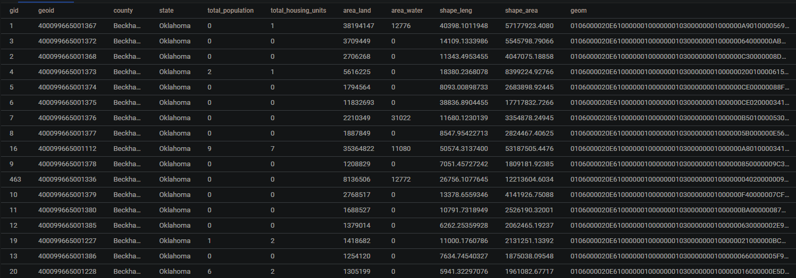
8. The data is already in the First Normal Form since there are only single-valued attributes.  
9. Further process the data by creating a table of summary statistics on the county level  
   - The table will contain Population by County, along with the other fields at the county level instead of the block level  
   ```SQL
   CREATE TABLE population_by_county AS
   SELECT
     county,
     state,
     COUNT(DISTINCT geoid) AS total_blocks,
     SUM(total_population) AS total_population,
     SUM(total_housing_units) AS total_housing_units,
     -- area_land, area_water are considered varchars.
     -- I had to cast to an integer type
     SUM(CAST(area_land AS INT)) AS area_land,
     SUM(CAST(area_water AS INT)) AS area_water,
     SUM(shape_leng) AS shape_leng,
     SUM(shape_area) AS shape_area,
   
   FROM
     population_filtered
   GROUP BY
     state, county;
   ```
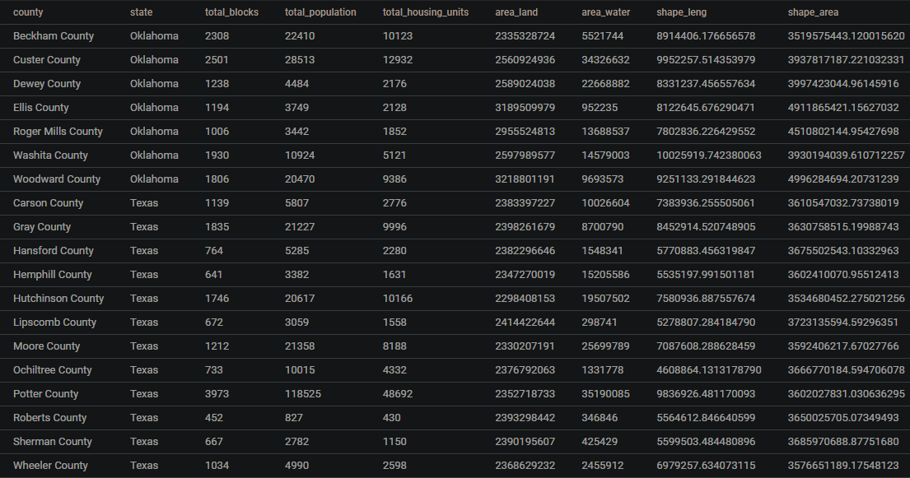

## Spatial Queries on Binary Burn Raster  
### Step 1: Identify total number of pixels using .rReport function of QGIS  
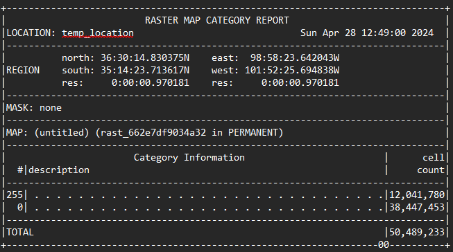

### Step 2: Batch Processing
1. Batch Size: 15 million
2. Total Pixels to Insert: ~50 million
   ```SQL
   -- Create a table for batch processing of pixels, 15 million at a time.
   CREATE TABLE texas_burnt_pixel_points (
       pixel_value DECIMAL
   );
   -- Batch
   DO $$
   DECLARE
       batch_size INT := 15000000;
       total_pixels INT;
       offsets INT := 0;
   BEGIN
       -- Count pixels
       SELECT COUNT(*) INTO total_pixels FROM texas_burntclassesclipped_rast;
       
       WHILE offsets < total_pixels LOOP
           INSERT INTO texas_burnt_pixel_points (pixel_value)
           SELECT (ST_PixelAsPoints(rast)).val AS pixel_value
           FROM texas_burntclassesclipped_rast
           OFFSET offsets ROWS FETCH NEXT LEAST(batch_size, total_pixels - offsets) ROWS ONLY;
           
           offsets := offsets + batch_size;
       END LOOP;
   END $$;
   ```
    
### Step 3: Get the total number of tiles    
The total number of pixels were too large to query. By querying by the number of tiles, we are able to include the entire raster. The total number of tiles is 56,363  
   ```SQL
   -- Get the total number of tiles in the raster
   SELECT COUNT(pixel_value) AS pixel_count
   FROM texas_burnt_pixel_points;
   ```
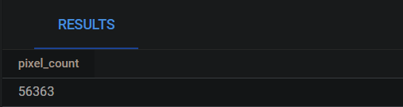

### Step 4: Get the total area of the raster 
The total area of the raster is 36,743 square kilometers 
   ```SQL
   -- Get the total area (sq km) of the raster (CROSS CHECKED IN QGIS) (36743.02775699519 sq km)
   SELECT SUM(ST_Area(rast::geometry::geography)) / 1000000.0 AS total_area_sq_km
   FROM texas_burntclassesclipped_rast;
   ```
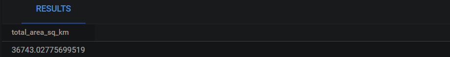

### Step 5: Create the pixel_summary table  
This table is necessary to know for upcoming calculations. In the binary burn raster, values of 1 represent burned areas while values of 0 represent unburned areas  
   ```SQL
   -- Get the total number of burnt 1 and unburnt 0 pixels (CROSS CHECKED IN QGIS TO CONFIRM 1 IS BURNT AND O IS UNBURNT) (56,363)
   CREATE TABLE texas_burnt_pixel_summary AS
   SELECT pixel_value, COUNT(*) AS count
   FROM texas_burnt_pixel_points
   GROUP BY pixel_value;
   ```
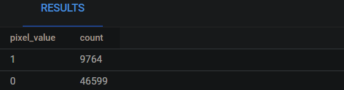

### Step 6: Confirm total pixels match the QGIS r.Report  
   ```SQL
   -- 56,363 records in table * (30x30) for each tile = 50,726,700 (matches the qgis expected total pixels)
   -- Calculate the total number of pixels
   SELECT COUNT(*) * (30 * 30) AS total_pixels
   FROM texas_burnt_pixel_points;
   ```
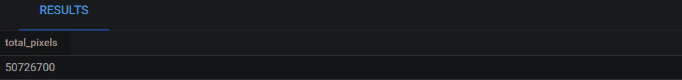

### Step 7: Calculate the total area of unburned and burned land  
   ```SQL
   -- Get total pixels, use to calculate area per pixel, total area unburned, and total area burned
   CREATE TABLE binary_results AS
   WITH pixel_summary AS (
       SELECT 
           COUNT(*) * (30 * 30) AS total_pixels
       FROM texas_burnt_pixel_points
   )
   SELECT 
   	-- Area per pixel should be 36743.02775699519 sq km  / 50,726,700 = 7.243330978950965e-4 sq km
       SUM(ST_Area(rast::geometry::geography)) / (1000000.0 * total_pixels) AS area_per_pixel_sq_km,
   	-- Calculate the total area unburned
   	-- 46599 records in the table * (30x30) for each tile = (41,939,100 pixels * area per pixel) = 30377.87822593224162315 sq km
   	(SELECT count FROM texas_burnt_pixel_summary WHERE pixel_value = 0) * (30 * 30) * SUM(ST_Area(rast::geometry::geography)) / (1000000.0 * total_pixels) AS total_area_unburned_sq_km,
   	-- Calculate the total area burned
   	-- 9764 records in the table * (30x30) for each tile = (8,787,600 pixels * area per pixel) = 6365.1495310629500034 sq km
   	(SELECT count FROM texas_burnt_pixel_summary WHERE pixel_value = 1) * (30 * 30) * SUM(ST_Area(rast::geometry::geography)) / (1000000.0 * total_pixels) AS total_area_burned_sq_km
   FROM texas_burntclassesclipped_rast, pixel_summary
   GROUP BY total_pixels;
   ```
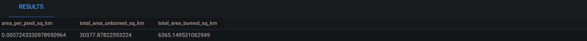  

### Overall, approximately 6,365.15 square kilometers were burned, and 30,377.88 square kilometers were left unburned.

## Spatial Queries on CONUS Land Cover Data 
### Step 1: Get the pixel values and the count of each, and classify by name  
1. Create a new table called landcover_raw_values to hold the pixel value as well as the pixel count
   ```SQL
      -- Get the pixel values and counts from the raster
   CREATE TABLE landcover_raw_values AS
   SELECT (ST_ValueCount(rast)).value AS pixel_value,
          (ST_ValueCount(rast)).count AS pixel_count
   FROM classified_landcover_clipped_rast;
   ```
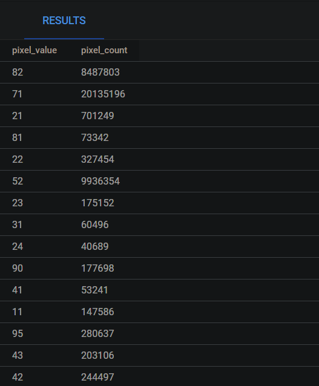
2. Create a new table called landcover_summary to convert pixel_values to the name of the corresponding land cover type  
   ```SQL
   -- Create a new table to summarize landcover
   CREATE TABLE landcover_summary (
       landcover_type TEXT,
       pixel_count INTEGER
   );
   
   INSERT INTO landcover_summary (landcover_type, pixel_count)
   SELECT 
       CASE
           WHEN pixel_value = 11 THEN 'Open Water'
           WHEN pixel_value = 12 THEN 'Perennial Ice/Snow'
           WHEN pixel_value = 21 THEN 'Developed, Open Space'
           WHEN pixel_value = 22 THEN 'Developed, Low Intensity'
           WHEN pixel_value = 23 THEN 'Developed, Medium Intensity'
           WHEN pixel_value = 24 THEN 'Developed High Intensity'
           WHEN pixel_value = 31 THEN 'Barren Land (Rock/Sand/Clay)'
           WHEN pixel_value = 41 THEN 'Deciduous Forest'
           WHEN pixel_value = 42 THEN 'Evergreen Forest'
           WHEN pixel_value = 43 THEN 'Mixed Forest'
           WHEN pixel_value = 51 THEN 'Dwarf Scrub'
           WHEN pixel_value = 52 THEN 'Shrub/Scrub'
           WHEN pixel_value = 71 THEN 'Grassland/Herbaceous'
           WHEN pixel_value = 72 THEN 'Sedge/Herbaceous'
           WHEN pixel_value = 73 THEN 'Lichens'
           WHEN pixel_value = 74 THEN 'Moss'
           WHEN pixel_value = 81 THEN 'Pasture/Hay'
           WHEN pixel_value = 82 THEN 'Cultivated Crops'
           WHEN pixel_value = 90 THEN 'Woody Wetlands'
           WHEN pixel_value = 95 THEN 'Emergent Herbaceous Wetlands'
           ELSE 'Other'
       END AS landcover_type,
       pixel_count
   FROM 
       (SELECT 
           pixel_value, 
           pixel_count
       FROM 
           landcover_raw_values
       ) AS v;
   ```   
3. The landcover_summary table should now look like this:  
   ```SQL
   -- Select from the new table
   SELECT * 
   FROM landcover_summary
   ORDER BY pixel_count DESC;
   ```
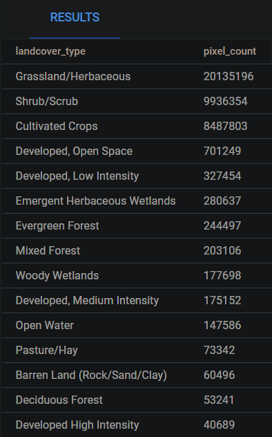

### Step 2: Calculate area per land cover type and add to a new table called landcover_area  
   ```SQL
   -- Calculate landcover area
   -- Get total pixels, use to calculate area per pixel, total area unburned, and total area burned
   CREATE TABLE landcover_area AS
   WITH pixel_summary AS (
       SELECT SUM(pixel_count) as total_pixels 
       FROM landcover_summary
   )
   SELECT 
   	-- Area per pixel should be 36743.02775699519 sq km  / 41044500 = 0.0008951997894236 sq km
       SUM(ST_Area(rast::geometry::geography)) / (1000000.0 * total_pixels) AS area_per_pixel_sq_km,
       (SELECT pixel_count FROM landcover_raw_values WHERE pixel_value = 11)* SUM(ST_Area(rast::geometry::geography)) / (1000000.0 * total_pixels) AS total_area_Open_Water_sq_km,
       (SELECT pixel_count FROM landcover_raw_values WHERE pixel_value = 21)* SUM(ST_Area(rast::geometry::geography)) / (1000000.0 * total_pixels) AS total_area_Developed_Open_Space_sq_km,
       (SELECT pixel_count FROM landcover_raw_values WHERE pixel_value = 22)* SUM(ST_Area(rast::geometry::geography)) / (1000000.0 * total_pixels) AS total_area_Developed_Low_sq_km,
       (SELECT pixel_count FROM landcover_raw_values WHERE pixel_value = 23)* SUM(ST_Area(rast::geometry::geography)) / (1000000.0 * total_pixels) AS total_area_Developed_Medium_sq_km,
       (SELECT pixel_count FROM landcover_raw_values WHERE pixel_value = 24)* SUM(ST_Area(rast::geometry::geography)) / (1000000.0 * total_pixels) AS total_area_Developed_High_sq_km,
       (SELECT pixel_count FROM landcover_raw_values WHERE pixel_value = 31)* SUM(ST_Area(rast::geometry::geography)) / (1000000.0 * total_pixels) AS total_area_Barren_Land_sq_km,
       (SELECT pixel_count FROM landcover_raw_values WHERE pixel_value = 41)* SUM(ST_Area(rast::geometry::geography)) / (1000000.0 * total_pixels) AS total_area_Deciduous_Forest_sq_km,
       (SELECT pixel_count FROM landcover_raw_values WHERE pixel_value = 42)* SUM(ST_Area(rast::geometry::geography)) / (1000000.0 * total_pixels) AS total_area_Evergreen_Forest_sq_km,
       (SELECT pixel_count FROM landcover_raw_values WHERE pixel_value = 43)* SUM(ST_Area(rast::geometry::geography)) / (1000000.0 * total_pixels) AS total_area_Mixed_Forest_sq_km,
       (SELECT pixel_count FROM landcover_raw_values WHERE pixel_value = 52)* SUM(ST_Area(rast::geometry::geography)) / (1000000.0 * total_pixels) AS total_area_Shrub_Scrub_sq_km,
       (SELECT pixel_count FROM landcover_raw_values WHERE pixel_value = 71)* SUM(ST_Area(rast::geometry::geography)) / (1000000.0 * total_pixels) AS total_area_Grassland_Herbaceous_sq_km,
       (SELECT pixel_count FROM landcover_raw_values WHERE pixel_value = 81)* SUM(ST_Area(rast::geometry::geography)) / (1000000.0 * total_pixels) AS total_area_Pasture_Hay_sq_km,
       (SELECT pixel_count FROM landcover_raw_values WHERE pixel_value = 82)* SUM(ST_Area(rast::geometry::geography)) / (1000000.0 * total_pixels) AS total_area_Cultivated_Crops_sq_km,
       (SELECT pixel_count FROM landcover_raw_values WHERE pixel_value = 90)* SUM(ST_Area(rast::geometry::geography)) / (1000000.0 * total_pixels) AS total_area_Woody_Wetlands_sq_km,
       (SELECT pixel_count FROM landcover_raw_values WHERE pixel_value = 95)* SUM(ST_Area(rast::geometry::geography)) / (1000000.0 * total_pixels) AS total_area_Emergent_Herbaceous_Wetlands_sq_km
   FROM classified_landcover_clipped_rast, pixel_summary
   GROUP BY total_pixels;
   ```

### Step 3: Add an area column to landcover_summary and transfer values from the landcover_area table  
   ```SQL
   -- Append to landcover_summary table
   ALTER TABLE landcover_summary ADD COLUMN area_sq_km NUMERIC;
   
   -- Update the area column using values from the landcover_area table
   UPDATE landcover_summary AS ls
   SET area_sq_km = 
       CASE 
           WHEN ls.landcover_type = 'Open Water' THEN la.total_area_Open_Water_sq_km
           WHEN ls.landcover_type = 'Developed, Open Space' THEN la.total_area_Developed_Open_Space_sq_km
           WHEN ls.landcover_type = 'Developed, Low Intensity' THEN la.total_area_Developed_Low_sq_km
           WHEN ls.landcover_type = 'Developed, Medium Intensity' THEN la.total_area_Developed_Medium_sq_km
           WHEN ls.landcover_type = 'Developed High Intensity' THEN la.total_area_Developed_High_sq_km
           WHEN ls.landcover_type = 'Barren Land (Rock/Sand/Clay)' THEN la.total_area_Barren_Land_sq_km
           WHEN ls.landcover_type = 'Deciduous Forest' THEN la.total_area_Deciduous_Forest_sq_km
           WHEN ls.landcover_type = 'Evergreen Forest' THEN la.total_area_Evergreen_Forest_sq_km
           WHEN ls.landcover_type = 'Mixed Forest' THEN la.total_area_Mixed_Forest_sq_km
           WHEN ls.landcover_type = 'Shrub/Scrub' THEN la.total_area_Shrub_Scrub_sq_km
           WHEN ls.landcover_type = 'Grassland/Herbaceous' THEN la.total_area_Grassland_Herbaceous_sq_km
           WHEN ls.landcover_type = 'Pasture/Hay' THEN la.total_area_Pasture_Hay_sq_km
           WHEN ls.landcover_type = 'Cultivated Crops' THEN la.total_area_Cultivated_Crops_sq_km
           WHEN ls.landcover_type = 'Woody Wetlands' THEN la.total_area_Woody_Wetlands_sq_km
           WHEN ls.landcover_type = 'Emergent Herbaceous Wetlands' THEN la.total_area_Emergent_Herbaceous_Wetlands_sq_km
           ELSE NULL
       END
   FROM landcover_area AS la;
   ```
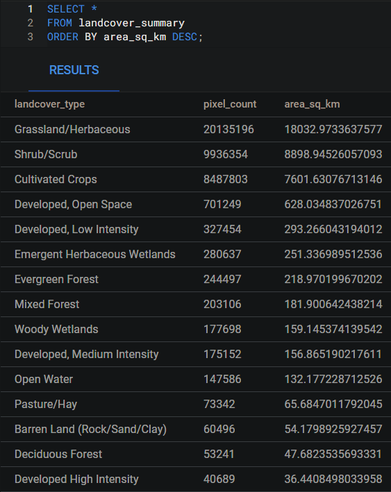
