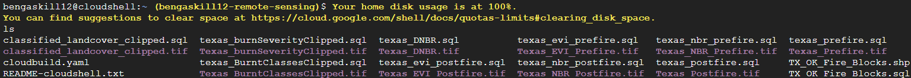

# Texas Wildfires: Change Detection of Smokehouse Creek Fire Using Google Earth Engine and PostGIS Spatial Database Queries

### Ben Gaskill
### IDCE 376, Spatial Database Development in Practice, Spring 2024
### Professor Jonathan Ocon and TA Kunal Malhan

This repository contains data and spatial analysis of the 2024 Smokehouse Creek Wildfire in Texas.

The initial contents of the repository can be navigated as follows:
1. The project proposal can be viewed in the *Gaskill_Proposal.pdf* document.
2. Google Earth Engine code for raster generation of FCC, EVI, NBR, DNBR, Burned Severity, and Burned Binary can be found [here](https://code.earthengine.google.com/b80f5e7fed31c15e0ee0efca2c5e241f)
3. The rubric can be viewed in the *Final_Project_Rubric.pdf* document.

## Data Sources
1. [Texas County Boundaries](https://gis-txdot.opendata.arcgis.com/datasets/TXDOT::texas-county-boundaries-detailed/about)
2. [Oklahoma County Boundaries](https://csagis-uok.opendata.arcgis.com/datasets/4180120bd0184f4c8183185947f638e7_0/explore?location=35.197309%2C-98.716546%2C6.80)
3. Texas 2020 Cenus Tract Block Level [(Obtained from ArcGIS Living Atlas)](https://www.arcgis.com/home/item.html?id=e71cbcf456084748ba0b8741d4f956d9)
4. Oklahoma 2020 Census Tract Block Level [(Obtained from ArcGIS Living Atlas)](https://www.arcgis.com/home/item.html?id=5ef7d4739af346ccba858abf2d70aeb9)
5. [2021 CONUS Landcover Dataset](https://www.mrlc.gov/viewer/)

## Pre-processing Steps
1. Detailed analysis of the wildfire was conducted in Google Earth Engine. See next section for details
2. Each output was exported from Google Earth Engine and visualized in QGIS.
3. The Texas and Oklahoma County Boundaries was subsetted and clipped to only include counties within the extent of the burn rasters.
4. The Texas and Oklahoma County 2020 Census data was opened in ArcGIS, and clipped to only include counties within the extent of the burn rasters. See below for an initial visualization.
5. The 2021 CONUS Landcover Dataset was clipped to the same extent as the other fire raster files.
6. A Google Cloud Postgres SQL database instance was set up and initialized with the name of "remotesensing", utilizing the existing Google Earth Engine Project with a subdirectory for this analysis.
7. All Raster files were vectorized utilizing the Polygonize function of QGIS and stored as a backup option. (Can be directly imported to a local POSTGIS enabled Postgres database using PGAdmin if necessary.

### 2020 Census Data Clipped to Extent of the Smokehouse Creek Fire

1. Texas Counties Include: Wheeler, Gray, Carson, Potter, Hemphill, Roberts, Hutchinson, Lipscomb, Ochiltree, Hansford, Sherman, and Moore Counties
2. Oklahoma Counties Include: Ellis, Woodward, Dewey, Roger Mills, Custer, Beckham, Washita

### 2021 CONUS Landcover Raster Clipped to Extent of the Smokehouse Creek Fire


## Description of raster (.TIF) files generated in Google Earth Engine
Landsat 9 Imagery was utilized. The original goal was to utilize Sentinel 2 imagery, but there were temporal inconsistencies.
1. FCC: False color composite, consisting of Short-Wave Infrared 2, Near Infrared, and Red bands of Landsat 9.
2. EVI: Enhanced Vegetation Index highlighting vegetation cover, using the following formula: EVI = 2.5 * ((NIR - RED) / (NIR + 6 * RED - 7.5 * BLUE  + 1))
3. NBR: Normalized Burn Ratio highlighting burned areas, using the following formula: NBR = (NIR -SWIR2) / (NIR + SWIR2)
4. DNBR: Difference Normalized Burn Ratio, an image differencing operation, using the following formula: dNBR = NBRprefire - NBRpostfire
5. Burned Severity: A classified burn map based on 5 classes: enhanced regrowth, unburned, low severity, moderate severity, and high severity.
6. Burned Binary: A binary classification map that shows burned vs unburned areas

## Map Layouts
### Prefire False Color Composite


### Postfire False Color Composite


### Prefire Enhanced Vegetation Index


### Postfire Enhanced Vegetation Index


### Prefire Normalized Burn Ratio


### Postfire Normalized Burn Ratio


### Difference Normalized Burn Ratio


### Burned Severity Classification
 <p align="center"></p>

### Burned vs Unburned Binary Classification


## Working with Google Cloud
### Pre-Processing Steps
1. Create a cloud project
2. Connect to Github and create triggers for push and pull
3. Create a cloud storage bucket and upload all rasters and shapefiles
4. Create Postgresql Instance in Google Cloud
   
### PostGIS Setup (in cloud console)
1. Navigate to the Postgresql bin  
   ```shell
   cd /usr/lib/postgresql/16/bin
   ```
3. Install PostGIS to Postgres  
   ```shell
   sudo apt install postgis
   ```
   
### Initial Connection, Database Creation, and Extensions (in cloud SQL shell)
1. Connect to Postgresql  
   ```shell
   gcloud sql connect remotesensing --user=postgres --quiet
   ```  
2. Create Database    
   ```SQL
   CREATE DATABASE TEXASWILDFIRES;
   ``` 
4. Connect to database    
   ```SQL
   \c texaswildfires;
   ```
6. Create Postgis Extension   
   ```SQL
   CREATE EXTENSION POSTGIS;
   ```  
8. Create Postgis Raster Extension    
   ```SQL
   CREATE EXTENSION POSTGIS_RASTER;
   ```

### Import rasters and shapefiles from Cloud Storage Bucket to Local Cloud Console Environment
1. Navigate back to default directory
   ```shell
   cd ~
   ```
2. Run the gsutil to access each file in the bucket and save to local directory
   ```shell
   gsutil cp gs://texas_wildfire_bucket/Texas_Prefire.tif Texas_Prefire.tif
   gsutil cp gs://texas_wildfire_bucket/Texas_Postfire.tif Texas_Postfire.tif
   gsutil cp gs://texas_wildfire_bucket/Texas_NBR_Prefire.tif Texas_NBR_Prefire.tif
   gsutil cp gs://texas_wildfire_bucket/Texas_NBR_Postfire.tif Texas_NBR_Postfire.tif
   gsutil cp gs://texas_wildfire_bucket/Texas_EVI_Prefire.tif Texas_EVI_Prefire.tif
   gsutil cp gs://texas_wildfire_bucket/Texas_EVI_Postfire.tif Texas_EVI_Postfire.tif
   gsutil cp gs://texas_wildfire_bucket/Texas_DNBR.tif Texas_DNBR.tif
   gsutil cp gs://texas_wildfire_bucket/Texas_BurntClassesClipped.tif Texas_BurntClassesClipped.tif
   gsutil cp gs://texas_wildfire_bucket/Texas_burnSeverityClipped.tif Texas_burnSeverityClipped.tif
   gsutil cp gs://texas_wildfire_bucket/classified_landcover_clipped.tif classified_landcover_clipped.tif
   gsutil cp gs://texas_wildfire_bucket/TX_OK_Fire_Blocks.shp TX_OK_Fire_Blocks.shp
   ```
The screenshot below shows the raster and vector files listed in the local directory:


### Convert all Rasters to SQL Files
1. When trying to run raster2pgsql, I encountered the following error  
   ```shell
   command "raster2pgsql" not found
   ```
2. If this error occurs, navigate back to the Postgresql bin and reinstall PostGIS before trying again
3. We can now successfully run the raster2pgsql command to convert all .tif files to .sql
   ```shell
   raster2pgsql -s 4326 -I -C -M Texas_Prefire.tif public.texas_prefire_rast > texas_prefire.sql
   raster2pgsql -s 4326 -I -C -M Texas_Postfire.tif public.texas_postfire_rast > texas_postfire.sql
   raster2pgsql -s 4326 -I -C -M Texas_NBR_Prefire.tif public.texas_nbr_prefire_rast > texas_nbr_prefire.sql
   raster2pgsql -s 4326 -I -C -M Texas_NBR_Postfire.tif public.texas_nbr_postfire_rast > texas_nbr_postfire.sql
   raster2pgsql -s 4326 -I -C -M Texas_EVI_Prefire.tif public.texas_evi_prefire_rast > texas_evi_prefire.sql
   raster2pgsql -s 4326 -I -C -M Texas_EVI_Postfire.tif public.texas_evi_postfire_rast > texas_evi_postfire.sql
   raster2pgsql -s 4326 -I -C -M Texas_DNBR.tif public.texas_DNBR_rast > texas_DNBR.sql
   raster2pgsql -s 4326 -I -C -M Texas_BurntClassesClipped.tif public.texas_BurntClassesClipped_rast > texas_BurntClassesClipped.sql
   raster2pgsql -s 4326 -I -C -M Texas_burnSeverityClipped.tif public.texas_burnSeverityClipped_rast > texas_burnSeverityClipped.sql
   raster2pgsql -s 4326 -I -C -M classified_landcover_clipped.tif public.classified_landcover_clipped_rast > classified_landcover_clipped.sql
   ```
   
### Fix 100% Storage in the Home Directory
1. Before running the shp2pgsql command for shapefiles, I encountered the following error:

2. Remove the unnecessary .tif files that are stored in the home directory. They are safely stored in the cloud storage bucket.
   ```shell
   rm Texas_Prefire.tif
   rm Texas_Postfire.tif
   rm Texas_NBR_Prefire.tif
   rm Texas_NBR_Postfire.tif
   rm Texas_EVI_Prefire.tif
   rm Texas_EVI_Postfire.tif
   rm Texas_DNBR.tif
   rm Texas_BurntClassesClipped.tif
   rm Texas_burnSeverityClipped.tif
   rm classified_landcover_clipped.tif
   ```
3. The home directory should now only contain the .sql files and the unconverted .shp files:  


### Backup All SQL Files
1. Safely store all raster .sql files by Pushing to the Cloud Storage Bucket
   ```shell
   gsutil cp texas_prefire.sql gs://texas_wildfire_bucket/
   gsutil cp texas_postfire.sql gs://texas_wildfire_bucket/
   gsutil cp texas_nbr_prefire.sql gs://texas_wildfire_bucket/
   gsutil cp texas_nbr_postfire.sql gs://texas_wildfire_bucket/
   gsutil cp texas_evi_prefire.sql gs://texas_wildfire_bucket/
   gsutil cp texas_evi_postfire.sql gs://texas_wildfire_bucket/
   gsutil cp texas_DNBR.sql gs://texas_wildfire_bucket/
   gsutil cp texas_BurntClassesClipped.sql gs://texas_wildfire_bucket/
   gsutil cp texas_burnSeverityClipped.sql gs://texas_wildfire_bucket/
   gsutil cp classified_landcover_clipped.sql gs://texas_wildfire_bucket/
   ```

### Convert Vector to SQL File
1. With enough space on the disk and important files backed up, we can continue to convert the last vector shapefile to an .sql file
2. IMPORTANT: In the next section, I ran into an issue with importing the shapefile .sql file into the database. This was solved by splitting the shapefile into three smaller shapefiles. As such, the previous file "TX_OK_Fire_Blocks.shp" should be completely removed from both the home directory and the cloud storage bucket  
   ```shell
   rm TX_OK_Fire_Blocks.shp
   ```
3. Using ArcGIS Pro, I subsetted the shapefile into the following 3 files using the following parameters:  
   Select by attribute where FID <= 13425 <- Save layer as shapefile called `population_first.shp`  
   Select by attribute where FID >= 13426 And FID <= 20138 <- Save layer as shapefile called `population_second.shp`  
   Select by attribute where FID >= 20139 <- Save layer as shapefile called `population_third.shp`
4. An error might occur when attempting to run the shp2pgsql command

6. This can be fixed by importing the .shx and .dbf files stored in the Cloud Bucket to the local home console directory
   ```shell
   gsutil cp gs://texas_wildfire_bucket/population_first.shx population_first.shx
   gsutil cp gs://texas_wildfire_bucket/population_first.dbf population_first.dbf

   gsutil cp gs://texas_wildfire_bucket/population_second.shx population_second.shx
   gsutil cp gs://texas_wildfire_bucket/population_second.dbf population_second.dbf
   ```
7. The shp2pgsql command can now be run successfully
   ```shell
   shp2pgsql -s 4326 -I population_first.shp public.population_first > population_first.sql
   shp2pgsql -s 4326 -I population_second.shp public.population_second > population_second.sql
   shp2pgsql -s 4326 -I population_third.shp public.population_third > population_third.sql
   ```
   
### Clean Home Directory and Backup Important Files
1. We can now remove the original shapefile, .shx and .dbf files from the home directory
   ```shell
   rm population_first.shp
   rm population_first.shx
   rm population_first.dbf

   rm population_second.shp
   rm population_second.shx
   rm population_second.dbf

   rm population_third.shp
   rm population_third.shx
   rm population_third.dbf
   ```
2. Backup the final population vector .sql file by Pushing to the Cloud Storage Bucket
    ```shell
   gsutil cp population_first.sql gs://texas_wildfire_bucket/
   gsutil cp population_second.sql gs://texas_wildfire_bucket/
   gsutil cp population_third.sql gs://texas_wildfire_bucket/
   ```
3. The home directory should now only contain the .sql files for all raster and vector files


### Connect to Postgres Database and Upload all .sql Files
1. We must first get the current directory in which the .sql files are stored and copy it to the clipboard
2. ```shell
   pwd
   /home/bengaskill12
   ```
3. Then connect to the Postgresql and the database
   ```shell
   gcloud sql connect remotesensing --user=postgres --quiet
   ```
   ```SQL
   \c texaswildfires
   ```
4. Within the database paste the path to the working directory
   ```SQL
   \cd /home/bengaskill12
   ```
5. Import each .sql file to the database
   ```SQL
   \i texas_prefire.sql
   \i texas_postfire.sql
   \i texas_nbr_prefire.sql
   \i texas_nbr_postfire.sql
   \i texas_evi_prefire.sql
   \i texas_evi_postfire.sql
   \i texas_DNBR.sql
   \i texas_BurntClassesClipped.sql
   \i texas_burnSeverityClipped.sql
   \i classified_landcover_clipped.sql
   \i population_first.sql
   \i population_second.sql
   \i population_third.sql
   ```
## Database Table Structure After all .sql Files are Uploaded


## Database Management: Data Cleaning and Normalization
1. The next step is to reconstruct the population dataset by joining the data into one single table  
2. This is simple since population_first, population_second, and population_third all have the same exact structure
3. Create a new table called population_all  
   ```SQL
   CREATE TABLE population_all AS
   SELECT * FROM population_first
   UNION ALL
   SELECT * FROM population_second
   UNION ALL
   SELECT * FROM population_third;
   ```  
4. Ensure the operation completed successfully and all 26,851 rows are present
   ```SQL
   SELECT COUNT(name)
   FROM population_all;
   ```  
  
5. The original population dataset has many unnecessary fields. Process the population dataset by only including relevant fields. The description for each field can be found [here](https://www.arcgis.com/home/item.html?id=b3642e91b49548f5af772394b0537681&view=list&sortOrder=desc&sortField=defaultFSOrder#data)
   ```
   Fields to keep:
   gid
   geoid
   county_nam
   state_name
   p0010001 (total population)
   h0010001 (total housing units)
   arealand (measured in square meters)
   areawatr (measured in square meters)
   shape_leng
   shape_area
   ```
6. Create a new table for Filtered Population, including only the relevant fields.
   ```SQL
   CREATE TABLE population_filtered AS
   SELECT gid, geoid, county_nam AS county, state_name AS state, p0010001 AS total_population, h0010001 AS total_housing_units, arealand AS area_land, areawatr AS area_water, shape_leng, shape_area
   FROM population_all;
   ```

8. The data is already in the First Normal Form since there are only single-valued attributes.
